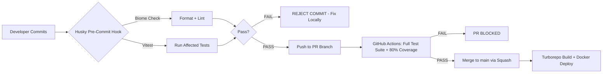

# 📜 Apex v2 Engineering Constitution & Modular Protocol  
*Binding Law for All Engineering Activities | Effective: January 30, 2026*  
**Document ID:** `APEX-CONST-2026-01` | **Classification:** `INTERNAL - EYES ONLY`  

---

## 🔱 PREAMBLE: THE NORTH STAR  
> *"From Landing Page to Live Store + Mobile App + Admin Panel in **under 60 seconds**."*  
This Constitution is the **single source of truth**. Violation of any clause invalidates deployment eligibility. This document supersedes all verbal agreements, Slack messages, or undocumented conventions. If the entire engineering team vanishes tomorrow, this Constitution enables reconstruction of Apex v2 *exactly*.  

---

## 🧱 PILLAR 1: THE "LEGO" PHILOSOPHY (STRICT MODULARITY)  
*Modularity is non-negotiable. Components must snap together like LEGO bricks—zero glue code.*  

### 🔷 Monorepo Strategy (Turborepo Enforcement)  
| Path | Type | Responsibility | Citation |
|------|------|----------------|----------|
| `apps/web` | Deployable | Marketing Site (Next.js 16) | `landing-page-masterlist.md` |
| `apps/storefront` | Deployable | Tenant Storefront (Next.js 16) | `store-features-masterlist.md` |
| `apps/admin` | Deployable | Tenant Admin Dashboard | `admin-dashboard-masterlist.md` |
| `apps/super-admin` | Deployable | Platform Control Tower | `super-admin-masterlist.md` |
| `apps/mobile` | Deployable | Expo React Native App | `architecture.md` (Mobile Strategy) |
| `packages/db` | Shared Kernel | Drizzle ORM schemas, pgvector helpers | `architecture.md` (Backend & Data) |
| `packages/auth` | Shared Kernel | JWT logic, S2 Tenant Isolation middleware | `architecture.md` (S2) |
| `packages/ui` | Shared Kernel | Radix UI + Tailwind primitives (Web + NativeWind) | `architecture.md` (Frontend) |
| `packages/events` | Shared Kernel | Typed event bus (Provisioning, Payment Webhooks) | *Critical for Pillar 3* |

**RULE 1.1:** `apps/*` **MUST NEVER** import from another `apps/*`. All cross-app communication occurs via `packages/events` or API contracts.  
**RULE 1.2:** `packages/*` **MUST** be versioned internally. Breaking changes require `MAJOR` bump in `package.json` and Turborepo cache invalidation.  

### 🔷 Service Isolation (Modular Monolith Boundaries)  
Each domain module **MUST** be encapsulated as a NestJS module with strict boundaries:  
```plaintext
modules/
├── checkout/          # Independent: Fails without crashing inventory
├── notifications/     # Independent: Queue-backed (Redis), isolated failure domain
├── provisioning/      # Critical path for 60-second goal (Pillar 3)
└── tenant-core/       # S2 Tenant Isolation enforcement (architecture.md)
```  
**RULE 1.3:** Modules **MUST** communicate via **events** (Redis Pub/Sub) or **typed HTTP contracts**—*never* direct database access across modules.  
**RULE 1.4:** If `notifications` crashes, `checkout` **MUST** complete orders and queue notifications for replay.  

---

## 📏 PILLAR 2: STANDARDIZATION & GOVERNANCE  
*Consistency is velocity. Deviation is technical debt.*  

### 🔷 Mandatory Folder Structure (NestJS Module)  
```bash
modules/checkout/
├── src/
│   ├── domain/        # Entities, Value Objects (DDD)
│   ├── application/   # Use Cases (PlaceOrder, CalculateTax)
│   ├── infrastructure/ # Repositories, External Services (Stripe)
│   ├── interfaces/    # Controllers, DTOs (Zod-validated)
│   └── checkout.module.ts
├── tests/             # Vitest suites (co-located)
└── events/            # Typed event definitions (OrderPlacedEvent)
```  
*Next.js pages follow identical domain-driven structure under `apps/storefront/app/(store)/[tenantId]/`*  

### 🔷 Naming Conventions (Biome-Enforced)  
| Artifact | Convention | Example | Enforcement |
|----------|------------|---------|-------------|
| Files | `kebab-case.ts` | `place-order.use-case.ts` | Biome lint rule |
| Classes | `PascalCase` | `OrderPlacedEvent` | Biome lint rule |
| DB Tables | `snake_case` | `tenant_123.orders` | Drizzle schema |
| Env Vars | `UPPER_SNAKE` | `JWT_SECRET` | Zod validation (S1) |
| Git Branches | `feat/checkout-v2` | `fix/provisioning-timeout` | Husky pre-push |

### 🔷 The Iron Gate (Git Flow)  

**RULE 2.1:** Zero tolerance for `// biome-ignore` or skipped tests. Violators face PR rejection.  
**RULE 2.2:** `main` branch **MUST** always be deployable. Hotfixes require CTO override.  

---

## ⚡ PILLAR 3: THE "1-MINUTE PROVISIONING" ENGINE  
*This sequence executes in <60 seconds. Every millisecond is audited.*  

### 🔷 Event-Driven Provisioning Flow  
1. **PAYMENT CONFIRMED**  
   - Stripe webhook → `provisioning` module (validated via Zod schema per S3)  
   - *Audit log created (S4)*  

2. **TENANT ISOLATION (S2 Enforcement)**  
   ```typescript
   // packages/db/src/provisioning.ts
   await drizzle.execute(sql`CREATE SCHEMA tenant_${tenantId}`);
   await drizzle.execute(sql`SET search_path = tenant_${tenantId}`);
   await seedStarterData(tenantId); // From super-admin "Onboarding Blueprint" (super-admin-masterlist.md §21)
   ```  
   *Resource quotas applied per tenant plan (super-admin-masterlist.md §04)*  

3. **DYNAMIC ROUTING (Zero Downtime)**  
   - Traefik watches PostgreSQL `tenants` table via middleware  
   - Auto-generates route: `https://store-name.apex.com → apps/storefront`  
   - SSL certificate provisioned via Traefik ACME (no restart)  

4. **MOBILE APP INSTANT BRANDING (Server-Driven UI)**  
   - Generic Expo app fetches `GET /api/tenant-config?domain=store-name.apex.com`  
   - Returns: `{ logoUrl, primaryColor, fontFamily, featureFlags }`  
   - App re-renders UI *at runtime* using NativeWind tokens (architecture.md §Mobile Strategy)  
   - **NO REBUILD. NO APP STORE RESUBMISSION.**  

**RULE 3.1:** Provisioning timeout > 55 seconds triggers PagerDuty alert.  
**RULE 3.2:** All steps **MUST** be idempotent. Duplicate webhooks cause no side effects.  

---

## 🧪 PILLAR 4: TESTING & QUALITY ASSURANCE  
*Untested code is broken code.*  

### 🔷 Vitest Strategy (Non-Negotiable)  
| Test Type | Location | Coverage Threshold | Critical Paths |
|-----------|----------|---------------------|----------------|
| Unit | `*.unit.test.ts` | 90% per module | Domain logic, Zod schemas |
| Integration | `*.integration.test.ts` | 85% | Module boundaries, DB transactions |
| E2E | `apps/*/e2e/` | 100% | Checkout flow, Provisioning sequence |
| Contract | `packages/events/tests/` | 100% | Event payload validation |

**RULE 4.1:** PRs require **minimum 80% aggregate coverage** (enforced by GitHub Action).  
**RULE 4.2:** E2E tests **MUST** simulate real user journey:  
`Landing Page → Template Select → Payment → Store Live + Mobile Config Fetch`  
*(Validates North Star goal)*  
**RULE 4.3:** GlitchTip error rate > 0.1% in staging **BLOCKS** production deploy.  

---

## 📚 PILLAR 5: SELF-DOCUMENTATION & TRUTH  
*Code lies. Schemas are law.*  

### 🔷 Zod as Single Source of Truth  
```typescript
// packages/events/src/order-placed.event.ts
export const OrderPlacedSchema = z.object({
  tenantId: z.string().uuid(), // Enforces S2 isolation
  orderId: z.string().uuid(),
  total: z.number().positive(),
  items: z.array(z.object({ sku: z.string(), qty: z.number() }))
});

// Auto-generates:
// - TypeScript types (no manual interfaces)
// - API request validation (S3)
// - Scalar API documentation
// - Vitest mock data factories
```  
**RULE 5.1:** All API inputs/outputs **MUST** derive from Zod schemas. Manual DTOs are forbidden.  
**RULE 5.2:** Environment variables **MUST** be validated at boot via `@nestjs/config` + Zod (S1). App crashes on invalid config.  

### 🔷 Auto-Documentation Mandate  
- **Scalar API Docs:** Generated from NestJS controllers + Zod schemas. Hosted at `/api/docs`.  
- **Architecture Decision Records (ADRs):** Every major decision logged in `/docs/adrs/` with date/approver.  
- **Runbook:** `/docs/runbook.md` contains exact steps to:  
  - Recover tenant from backup (super-admin-masterlist.md §18)  
  - Activate Maintenance Mode (super-admin-masterlist.md §20)  
  - Emergency Kill Switch procedure (super-admin-masterlist.md §03)  

**RULE 5.3:** Documentation drift > 24 hours triggers CI failure. Docs are code.  

---

## ⚖️ CONSTITUTIONAL AMENDMENTS  
1. Amendments require **unanimous approval** from CTO + Lead Architects.  
2. All changes logged in `/docs/constitution-changelog.md` with rationale.  
3. Previous versions archived immutably.  

> *"This Constitution is not a suggestion. It is the operating system of Apex v2.  
> Build with precision. Ship with pride. Govern with integrity."*  
> **— Apex v2 Chief Software Architect & CTO**  
> *January 30, 2026 | Document Hash: sha256:apex-const-2026-01*  

🔒 **END OF CONSTITUTION**  
*Violations reported to GlitchTip. Compliance verified by Biome.*