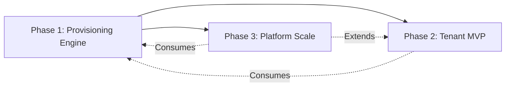

# 🧱 Apex v2 Strategic Roadmap & Lego-Architecture Blueprint  
*Logical Progression of Dependencies | Binding Execution Protocol | Document ID: `APEX-ROADMAP-2026-01`*  

---

## 📐 PART 1: THE ENGINEERING STRUCTURE (THE SKELETON)  
*Physical monorepo anatomy derived strictly from `architecture.md` and modular constraints.*  

### 🔷 Monorepo Anatomy (`turbo.json` enforced)  
```bash
apex-v2/
├── apps/
│   ├── web                 # Marketing Site (Next.js 16) → landing-page-masterlist.md
│   ├── storefront          # Tenant Storefront (Next.js 16) → store-features-masterlist.md
│   ├── admin               # Tenant Admin Dashboard (Next.js 16) → admin-dashboard-masterlist.md
│   ├── super-admin         # Platform Control Tower (Next.js 16) → super-admin-masterlist.md
│   └── mobile              # Expo React Native App → architecture.md (Mobile Strategy)
│
├── packages/
│   ├── db                  # Drizzle ORM schemas + pgvector helpers + S2 Tenant Isolation middleware
│   ├── auth                # JWT logic, TenantScopedGuard, S1/S3 validation (Zod)
│   ├── ui                  # Radix UI primitives + Tailwind config + NativeWind tokens (shared Web/Mobile)
│   ├── events              # Typed event bus (ProvisioningEvent, PaymentConfirmedEvent)
│   ├── config              # Zod-validated env schemas (S1 enforcement)
│   ├── validators          # Shared Zod schemas (API contracts, S3)
│   └── utils               # Cross-cutting utilities (date, encryption, S7)
│
├── docker/                 # Traefik config, Docker Compose (Postgres/Redis/MinIO)
├── turbo.json              # Pipeline: "db#build" → "auth#build" → "apps/*#build"
└── biome.json              # Enforced lint rules (kebab-case files, PascalCase classes)
```  

### 🔷 The Glue: Zero-Coupling Consumption Protocol  
| Package | Consumption Pattern | Anti-Coupling Safeguard |
|---------|---------------------|-------------------------|
| `@apex/db` | Apps import *typed queries only* via `db/queries/tenant.ts` | **STRICT:** Apps NEVER import Drizzle client directly. All DB access routed through package-defined query functions. |
| `@apex/auth` | NestJS modules inject `AuthService`; Frontends use `auth-client.ts` | **STRICT:** No raw JWT handling in apps. All auth logic encapsulated in package. |
| `@apex/ui` | Web: `import { Button } from '@apex/ui/web'`<br>Mobile: `import { Button } from '@apex/ui/mobile'` | **STRICT:** Design tokens (colors, spacing) defined ONCE in `@apex/ui/tokens.ts`. NativeWind consumes same tokens. |
| `@apex/events` | Backend publishes via `eventBus.publish(OrderPlacedEvent)`<br>Frontend subscribes via typed hooks | **STRICT:** Events are immutable Zod-validated payloads. No direct module-to-module calls. |  

**RULE S1:** Turborepo pipeline **MUST** fail if an `apps/*` imports from another `apps/*`.  
**RULE S2:** All inter-package dependencies declared in `package.json` with `workspace:*` versioning.  

---

## 🗺️ PART 2: PHASED EXECUTION ROADMAP (THE STRAIGHT PATH)  
*Logical dependency chain. Each phase is a shippable Lego block. No phase depends on future phases.*  

### 🌱 PHASE 1: CORE INFRASTRUCTURE & PROVISIONING ENGINE  
*Foundation for the North Star: "60-Second Tenant Birth"*  

| Component | Specification |
|-----------|---------------|
| **Target Goals** | `architecture.md` §3 (Provisioning Flow), `super-admin-masterlist.md` §21 (Onboarding Blueprint), `landing-page-masterlist.md` §§01,04 (Critical Path: Hero → Payment) |
| **Lego Block Deliverable** | **Provisioning Core Service** (NestJS module + Traefik middleware + Seed Engine) |
| **Definition of Done** | • Docker Compose stack running (Traefik/Postgres/Redis/MinIO)<br>• `POST /api/webhooks/stripe` endpoint (validated via Zod)<br>• CLI script: `bun run provision:tenant --name=test-store`<br>• Tangible Output: After script execution:<br>  - `test-store.apex.localhost` resolves to storefront placeholder<br>  - Postgres contains `tenant_test_store` schema with seeded data<br>  - MinIO bucket `tenant-test-store-assets` created |
| **Acceptance Tests** | 1. **Infra Boot Test:** `docker compose up -d` → All containers HEALTHY (verify via `docker compose ps`)<br>2. **Schema Isolation Test:** Run provisioning script → Connect to Postgres → Confirm `tenant_test_store.orders` table exists AND `public.orders` is EMPTY<br>3. **Routing Test:** `curl -H "Host: test-store.apex.localhost" http://localhost` → Returns HTTP 200 with "Store Provisioned" HTML<br>4. **Idempotency Test:** Trigger provisioning twice for same store name → Second run returns HTTP 409 (Conflict), NO duplicate schema<br>5. **Timing Gate:** `time bun run provision:tenant --name=perf-test` → **MUST** complete in ≤ 55 seconds (measured from CLI start to Traefik route active) |

---

### 🛒 PHASE 2: TENANT MVP (STOREFRONT + ADMIN CORE)  
*Self-contained tenant experience. Zero dependency on Super Admin or Mobile.*  

| Component | Specification |
|-----------|---------------|
| **Target Goals** | `store-features-masterlist.md` §§01-08,13-17,28-30,35 (Core Shopping + Essential Account)<br>`admin-dashboard-masterlist.md` §§01,17,21,27,28 (White-Labeling + Operations Core + RBAC) |
| **Lego Block Deliverable** | **Tenant Experience Bundle**:<br>- Storefront App (Next.js): Product catalog, cart, checkout, user accounts<br>- Admin App (Next.js): Product CRUD, order management, staff RBAC, theme editor<br>- Backend Modules: `@checkout`, `@products`, `@orders`, `@rbac` (NestJS) |
| **Definition of Done** | • Storefront: `/:tenantId/products/[slug]` renders PDP with tenant branding (logo/colors from DB)<br>• Admin: `/:tenantId/admin/login` → Dashboard showing tenant name + "Add Product" button<br>• RBAC: Staff user with "viewer" role CANNOT access `/admin/products/create` (403 Forbidden)<br>• Tangible Output:<br>  1. Create product via Admin → Appears on Storefront within 2 seconds<br>  2. Place test order → Admin shows "Processing" status + PDF invoice generator<br>  3. Change logo in Admin Theme Editor → Storefront header updates on refresh |
| **Acceptance Tests** | 1. **Checkout Flow Test:** Add product → Checkout → Stripe test payment → Order appears in Admin "Orders" tab with status "Paid"<br>2. **Tenant Isolation Test:** Log in as Tenant A staff → Attempt to access `tenant-b/admin/orders` → Returns 403 Forbidden (S2 enforcement)<br>3. **Branding Propagation Test:** Upload new logo in Admin → Visit Storefront → Logo matches uploaded asset (served via MinIO)<br>4. **RBAC Test:** Create staff user with "fulfillment" role → Verify they see Orders tab but NOT Products tab<br>5. **Audit Trail Test:** Delete product in Admin → Query `audit_logs` table → Entry exists: `{ action: "PRODUCT_DELETED", user: "staff@tenant.com", tenant_id: "x" }` (S4 compliance) |

---

### 🌐 PHASE 3: PLATFORM SCALE & ADVANCED ECOSYSTEM  
*Cross-tenant governance + Mobile convergence. Depends ONLY on Phase 1 Provisioning Engine.*  

| Component | Specification |
|-----------|---------------|
| **Target Goals** | `super-admin-masterlist.md` ALL SECTIONS (Tenant Governance, Financial, Security)<br>`admin-dashboard-masterlist.md` §§06-12,34-40 (Marketing, AI, Advanced Ops)<br>`architecture.md` (Mobile Strategy: Server-Driven UI)<br>`store-features-masterlist.md` (B2B, Affiliates, Subscriptions) |
| **Lego Block Deliverable** | **Platform Control Plane**:<br>- Super Admin App (Next.js): Tenant management, feature flags, global audit log<br>- Mobile App (Expo): Single binary fetching tenant config at runtime<br>- Advanced Modules: `@affiliates`, `@ai-content`, `@subscriptions` (NestJS)<br>- Feature Flag Service (Redis-backed) |
| **Definition of Done** | • Super Admin: "God Mode" button → Instantly logs into any tenant's Admin Dashboard<br>• Mobile: Generic Expo app → Scan QR code for `tenant-x` → App rebrands with tenant-x colors/logo<br>• Feature Flag: Toggle "ai_writer" OFF in Super Admin → Tenant Admins see grayed-out "AI Generate Description" button<br>• Tangible Output:<br>  1. Super Admin suspends tenant → Storefront returns 503 "Maintenance Mode" (super-admin-masterlist.md §20)<br>  2. Mobile app fetches `GET /api/mobile/config?domain=tenant-x.apex.com` → Returns `{ primaryColor: "#2563eb", logoUrl: "minio/..." }`<br>  3. Enable "fraud_detection" flag → New orders show AI risk score in Admin |
| **Acceptance Tests** | 1. **God Mode Test:** In Super Admin, click "Impersonate" on Tenant Y → Redirects to `tenant-y/admin` with full access (no password)<br>2. **Mobile SDUI Test:** Build Expo app ONCE → Point to `tenant-a.apex.com` → App shows Tenant A branding; Point to `tenant-b.apex.com` → Instantly shows Tenant B branding (NO rebuild)<br>3. **Kill Switch Test:** Super Admin clicks "Suspend" on tenant → Storefront returns 503; Admin Dashboard inaccessible; Mobile app shows "Store Temporarily Unavailable"<br>4. **Feature Gating Test:** Assign "Basic" plan to tenant → Tenant Admin CANNOT access "AI Content Writer" (admin-dashboard-masterlist.md §34); Upgrade to "Pro" → Feature appears instantly<br>5. **Cross-Tenant Safety Test:** As Super Admin, query DB directly → Confirm `tenant_z.orders` contains ONLY Tenant Z data (S2 isolation intact during platform operations) |

---

## ⚙️ CRITICAL DEPENDENCY CHAIN (THE STRAIGHT PATH)  

- **Phase 1 is the atomic nucleus.** Without it, Phases 2/3 cannot exist.  
- **Phase 2 is tenant-agnostic.** It operates *within* a tenant context created by Phase 1. Zero knowledge of other tenants.  
- **Phase 3 is the orchestrator.** It leverages Phase 1's provisioning engine and Phase 2's tenant apps but adds cross-tenant intelligence.  
- **Mobile (Phase 3) depends ONLY on Phase 1's config endpoint** (`/api/mobile/config`). It does NOT require Phase 2 storefront to be complete.  

---

## 🚫 ABSOLUTE PROHIBITIONS (BINDING)  
1. **NO** monolithic "admin" app containing tenant + super-admin logic. Violation = immediate rollback.  
2. **NO** direct database access across tenant boundaries. All cross-tenant operations MUST flow through Super Admin service with explicit audit logging (S4).  
3. **NO** hard-coded feature flags. All toggles MUST originate from Super Admin's Feature Flags module (super-admin-masterlist.md §12).  
4. **NO** mobile app rebuilds for tenant onboarding. Server-Driven UI (architecture.md) is non-negotiable.  

> *"This roadmap is not a suggestion. It is the architectural DNA of Apex v2.  
> Build the blocks. Verify the tests. Ship the value."*  
> **— Apex v2 Chief Software Architect & Project Director**  
> *January 30, 2026 | Hash: sha256:apex-roadmap-2026-01*  

🔒 **END OF BLUEPRINT**  
*Execute in sequence. Deviate at your peril.*